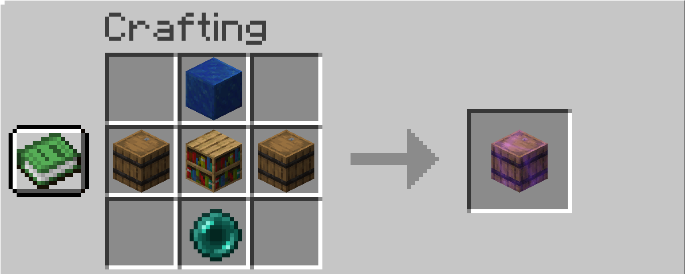
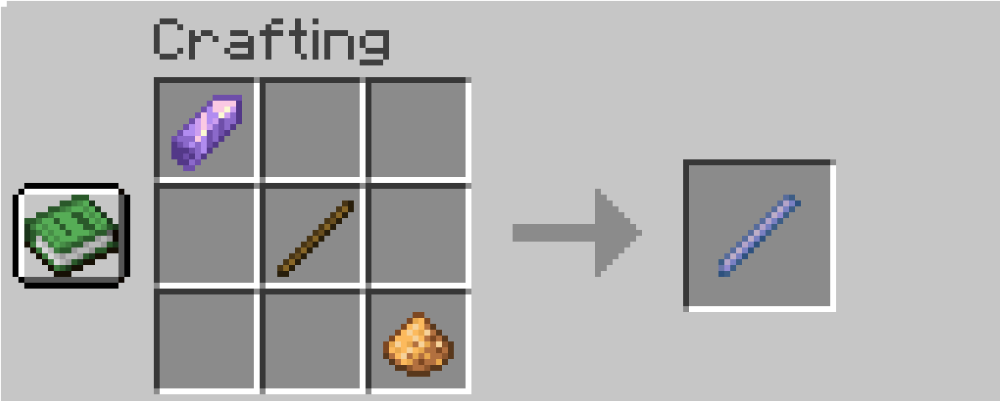
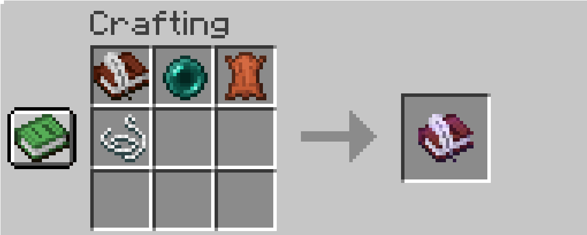

# Repository

Repository is an AE2 inspired storage datapack for Minecraft versions 1.21.5-1.21.5.

## Installation

To install, download .zip file of this repository, then place it into the datapack folder for your world.

## Crafting Recipes

Level 1 Repository

Level 2 Repository

Level 3 Repository

Repository Wand

Level 1 Drive

## License

[MIT](https://choosealicense.com/licenses/mit/)
